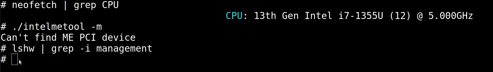

# How to disable the intel management engine in Intel Devices?

My device is "21JK0006TX ThinkPad E14 Gen 5".

My UEFI BIOS version is 1.31

My **ME FIRMWARE VERSION** is 16.1.25.2091

1. Enter to UEFI BIOS settings
2. Disable secure boot first
3. Then, completly disable the security chip (TPM)
4. Enable all the three options in the virtualization (*it might not be directly related but i am not sure*)
5. Finally, permanently disable the Absolute Persistance
6. (reboot)
7. run the intelmetool, it should be like that:

$ sudo ./intelmetool -m

Can't find ME PCI device

